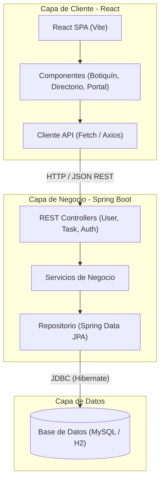

# 🧠 Mente Conecta — Plataforma Práctica de Salud Mental

Este repositorio contiene la arquitectura, el código fuente y el flujo de integración de la **Plataforma Práctica de Salud Mental (Mente Conecta)**, un sistema ágil y psicoeducativo orientado a la autogestión de la salud mental y la colaboración con profesionales clínicos.

---

## 🛡️ Status & Tech Badges


---

## 🏛️ Arquitectura del Sistema

El proyecto está estructurado como una aplicación desacoplada en tres capas (Frontend en React, Backend en Spring Boot, y Base de Datos Relacional).



---

## 🛠️ Stack Tecnológico

| Componente | Tecnologías Utilizadas |
| :--- | :--- |
| **Frontend** | React, Vite, HTML5, CSS3, JavaScript (ES6+), React Hooks |
| **Backend** | Java 17+, Spring Boot (Web, JPA, Validation), Lombok |
| **Base de Datos** | MySQL (Producción), H2 (Desarrollo y Pruebas en Memoria) |
| **CI / CD** | GitHub Actions (Maven Workflow, CodeQL) |
| **Licencia** | GNU General Public License v3.0 (GPLv3) |

---

## 🚀 Funcionalidades Clave

### 1. Botiquín de Ayuda Inmediata
- **Ejercicios de Respiración:** Temporizador interactivo guiado utilizando la técnica de caja (4-4-4-4).
- **Botón de Grounding:** Módulo interactivo basado en la técnica cognitiva-conductual 5-4-3-2-1.
- **Micro-Hábitos:** Tarjetas y checklists diarios orientados a la Terapia Cognitivo Conductual (TCC).

### 2. Biblioteca Práctica y Recursos
- **Material Rotativo:** Fichas descargables e infografías sobre psicología y bienestar general.
- **Librería de Afiliados:** Enlaces estructurados a libros de autoayuda con rigor científico en Amazon.

### 3. Portal de Profesionales & Directorio
- **Gestión Clínica:** Repositorio seguro para que profesionales registrados descarguen pautas y material clínico.
- **Directorio Clasificado:** Buscador y filtros avanzados de psicólogos, coaches y terapeutas de apoyo.

---

## 📂 Estructura del Directorio

```text
mental-app/
├── .github/
│   └── workflows/
│       ├── codeql.yml            # Análisis estático de seguridad de código
│       └── maven.yml              # CI de compilación y pruebas para Java
├── backend/
│   ├── src/
│   │   ├── main/
│   │   │   ├── java/com/example/demo/
│   │   │   │   ├── controller/   # Controladores de la API REST
│   │   │   │   ├── model/        # Entidades JPA (User, Task, etc.)
│   │   │   │   ├── repository/   # Interfaces Spring Data JPA
│   │   │   │   └── service/      # Lógica de servicio y negocio
│   │   │   └── resources/
│   │   │       └── application.properties  # Configuración (H2/MySQL)
│   │   └── test/                 # Pruebas unitarias de Spring Boot
│   └── pom.xml                   # Configuración del proyecto Maven
├── database/
│   └── database.sql              # Esquema SQL original de la base de datos
├── index.html                    # Frontend estático original
├── style.css                     # Estilos generales del MVP estático
├── script/
│   └── script.js                 # Lógica interactiva original en Vanilla JS
├── LICENSE                       # Licencia GPLv3
└── README.md                     # Documentación principal del repositorio
```

---

## ⚙️ Configuración y Ejecución Local

### Prerrequisitos
- **Java JDK 17** o superior instalado en el equipo.
- **Node.js** y npm (para el desarrollo con React).

### Backend (Spring Boot)
1. Navega al directorio del backend:
   ```bash
   cd backend
   ```
2. Ejecuta la aplicación utilizando Maven (el archivo utiliza base de datos H2 en memoria por defecto):
   ```bash
   mvn spring-boot:run
   ```
3. La API estará disponible en `http://localhost:8080`.
4. La consola H2 interactiva se encuentra en `http://localhost:8080/h2-console` (Credenciales: URL: `jdbc:h2:mem:taskdb`, Usuario: `sa`, sin contraseña).

### Configuración de MySQL
Para conectar la aplicación a un servidor MySQL real, edita el archivo `backend/src/main/resources/application.properties` para descomentar las propiedades correspondientes:
```properties
spring.datasource.url=jdbc:mysql://localhost:3306/mente_conecta_db?useSSL=false&serverTimezone=UTC
spring.datasource.username=tu_usuario
spring.datasource.password=tu_contraseña
```

---

## 🔄 Flujo de Integración Continua (CI)
El workflow [maven.yml](file:///c:/Users/Ricardo/Desktop/rep/mental-app/.github/workflows/maven.yml) se ejecuta automáticamente en cada `push` o `pull_request` a la rama principal:
1. Configura un entorno Ubuntu.
2. Inicializa Java JDK 17 (Temurin).
3. Compila el backend ejecutando `mvn clean package -DskipTests`.
4. Ejecuta toda la suite de pruebas unitarias mediante `mvn test`.

---

## 📝 Descripción del Pull Request (Rama `agregar-propiedades`)

Esta rama contiene la integración del backend en Java Spring Boot junto con la configuración de la base de datos Neon PostgreSQL y las canalizaciones de CI/CD. Los cambios clave incluidos en este pull request son:

### 1. Base de Datos Neon (PostgreSQL)
- Migración de la configuración de base de datos de MySQL a **PostgreSQL** para una integración nativa con **Neon**.
- Configuración de dependencias en [pom.xml](file:///c:/Users/Ricardo/Desktop/rep/mental-app/backend/pom.xml) (`org.postgresql:postgresql`).
- Creación de variables de entorno y plantillas de conexión JDBC en [application.properties](file:///c:/Users/Ricardo/Desktop/rep/mental-app/backend/src/main/resources/application.properties) con soporte para SSL.
- Configuración de base de datos H2 en memoria como fallback de desarrollo y pruebas automatizadas (evitando el uso de credenciales expuestas en CI).

### 2. Entidades & Modelos de Dominio
Se implementaron los siguientes modelos en inglés ([backend/src/main/java/com/example/demo/model](file:///c:/Users/Ricardo/Desktop/rep/mental-app/backend/src/main/java/com/example/demo/model)) mapeados con anotaciones JPA a las tablas en español definidas en el diagrama relacional (`dbdiagram.io`):
- **`User` (Tabla `usuarios`):** Registro de pacientes y credenciales.
- **`Professional` (Tabla `profesionales`):** Registro de psicólogos, coaches y voluntarios.
- **`SessionReservation` (Tabla `reservas_sesiones`):** Agendamiento y estados de las sesiones de telemedicina.
- **`JournalEntry` (Tabla `diario_emocional`):** Bitácora de autogestión y privacidad del diario.
- **`Feedback` (Tabla `valoraciones_profesional`):** Retroalimentación de pacientes a profesionales.
- **Enums de Configuración:** `Gender`, `UserStatus`, `ProfessionalStatus`, `SessionType`, `SessionStatus`, y `PrivacyStatus`.

### 3. Repositorios de Capa de Persistencia
- Interfaces que extienden `JpaRepository` para todas las entidades nuevas, soportando búsquedas relacionales:
  - `UserRepository`
  - `ProfessionalRepository`
  - `SessionReservationRepository`
  - `JournalEntryRepository`
  - `FeedbackRepository`

### 4. Automatización & Integración Continua (CI/CD)
- **CI de Compilación y Test ([maven.yml](file:///c:/Users/Ricardo/Desktop/rep/mental-app/.github/workflows/maven.yml)):** Compila el código y ejecuta los tests unitarios en cada push/PR.
- **Análisis Estático ([codeql.yml](file:///c:/Users/Ricardo/Desktop/rep/mental-app/.github/workflows/codeql.yml)):** Configurado para escanear código en Java y JavaScript.
- **Revisiones Automatizadas ([sourcery.yml](file:///c:/Users/Ricardo/Desktop/rep/mental-app/.github/workflows/sourcery.yml)):** Integración con Sourcery AI para PRs.

